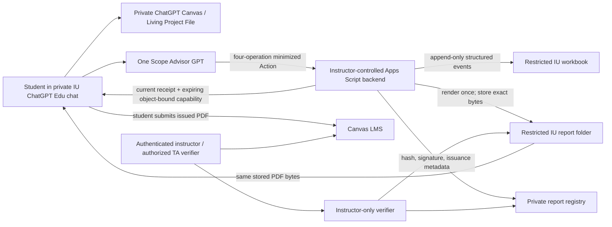

# Privacy and Data-Flow Review

## Trust boundaries

| Surface | Permitted | Prohibited |
|---|---|---|
| Private chat and Living Project File | Current student's artifacts, short critique excerpts, revisions, justifications, and private evaluator rationale | Another student's data; unnecessary personal or sensitive information |
| GPT Action | Pseudonymous identifiers, controlled events, structured metrics, score values without excerpts, four sanitized digest lines, and a current report request | Transcripts, full drafts, evidence excerpts, hidden reasoning, direct identifiers, grades, credentials, client report prose/bytes/hash/signature |
| Workbook | Opaque-key mapping, append-only events, one idempotent daily summary, gate records, and minimal report-event metadata | Student-facing reads; raw capabilities or verification tokens; Drive object IDs; report signing material |
| Report storage and registry | Immutable PDF objects; server-computed length/hash; signed issuance metadata; prior-issuance links | Public link sharing; overwriting earlier reports; student or GPT browsing |
| Canvas LMS | Student-submitted issued PDF and instructor-controlled grade | Automatic grade changes from advisory telemetry |

## Public Action boundary

The only public operations are `startSession`, `logEvent`, `closeSession`, and `issueReport`. Normal responses are minimal acknowledgements. `issueReport` is the sole narrow delivery exception: after server authorization, it may return the current student's minimal receipt and a short-lived opaque capability for exactly one stored PDF object. It is not an arbitrary workbook, registry, or Drive read.

The backend may read current-student state internally only to authorize the request, derive attempt/generation, build a sanitized report model, stream the declared object, and support the authenticated instructor verifier. The verifier is outside the student GPT Action.

## Required controls

- Visible, versioned consent precedes `startSession`; declined or missing consent produces no write.
- The single term-scoped opaque key routes records but does not prove identity.
- Deployment secrets and report signing keys stay in Script Properties.
- `LockService` protects index/tab creation, idempotency, attempt/generation transitions, daily summary upsert, and report issuance.
- Server time, attempt, generation, report ID, status, template/schema version, hash, and signature are authoritative.
- Payloads are strict, bounded, allowlisted, rate-limited, and spreadsheet-formula neutralized.
- Events and report registry records are append-only; an issued PDF object is never overwritten.
- The report backend renders once, stores the bytes, rereads and hashes the stored object, and signs private registry metadata before returning success.
- A re-download or refreshed capability streams the same object. A same-attempt regeneration creates a visibly marked new object and preserves all earlier issuances.
- Raw download capabilities and verification tokens never enter the workbook, report body, Living Project File, summary, or logs.
- Storage and workbook access use named instructors/TAs only and follow the configured IU retention policy.
- Accidental personal, sensitive, or emotional content is not repeated or exported; request a sanitized replacement when needed. The only permitted pacing note is `student requested slower pacing`.
- Instructor testing uses authenticated deployment configuration, synthetic keys, isolated Sheets/Drive/report-registry storage, marked reports, and no Canvas-grade or production-export path. Production fails closed before any write if test mode is enabled or storage is not isolated.
- Prompt-injection content is untrusted course material. Retain at most an approved aggregate integrity reason code; never log the attempted instruction text, challenged-source prose, hidden prompt content, or instructor-handoff details.

## Residual risks

- A shared or stolen student key can misroute advisory telemetry because the key is not strong identity authentication.
- Matching registered bytes proves file integrity after issuance, not authorship, truthfulness, or student intent.
- Prompts, knowledge files, schemas, and Action descriptions may be extractable; security cannot depend on secrecy of those materials.
- Tenant behavior, Canvas/Living Project File export, Drive controls, and Apps Script authorization require live-IU verification.
- A failed storage transaction can leave an uncommitted object that must be quarantined or cleaned up without treating it as an issuance.

These risks are bounded by private sessions, no general read endpoint, current-object authorization, data minimization, immutable history, instructor verification, term rotation, and Canvas/instructor grade authority.
